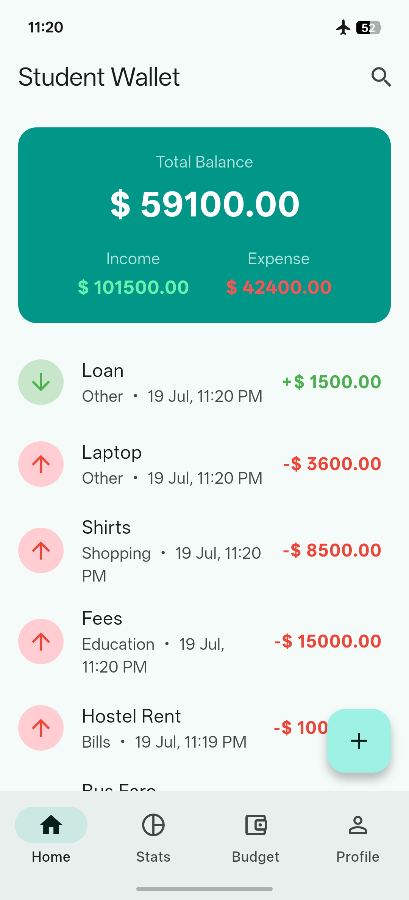
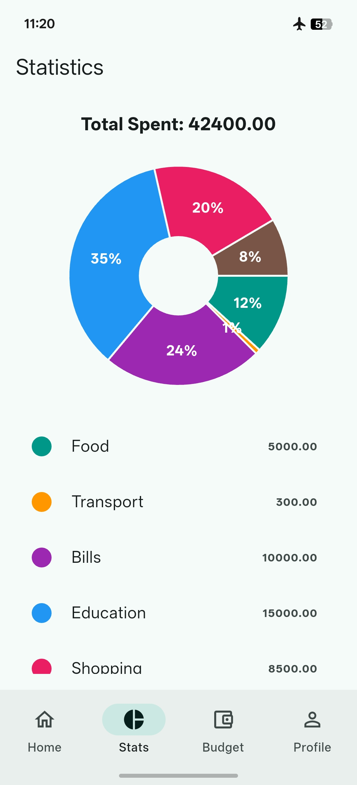
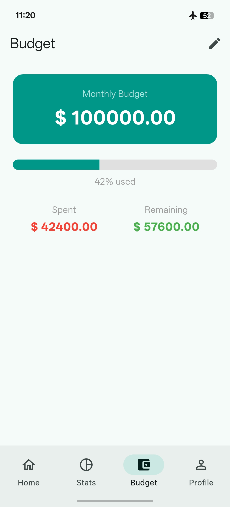
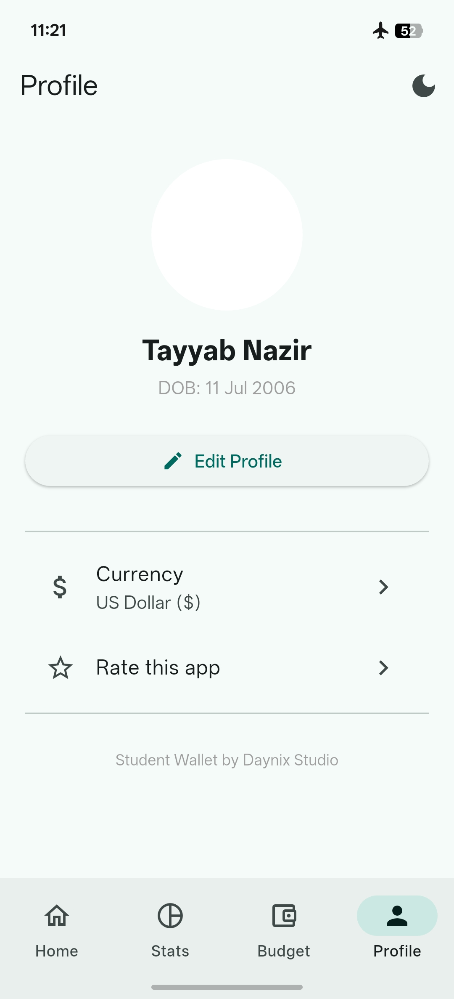

# 💰 Student Wallet

> **Track expenses, set budgets & save smart — offline student wallet with no login required.**

<p align="center">
  
  
</p>

<p align="center">
  
  
</p>

---

# 📖 About

Student Wallet is a modern offline expense tracker built with Flutter.

It helps students manage income, expenses, monthly budgets and spending statistics in a simple and beautiful interface.

No login required.

No internet required.

Your data stays completely on your own device.

---

# ✨ Features

- 💰 Dashboard with Balance Overview
- ➕ Add Income & Expense Transactions
- 🎯 Monthly Budget Planning
- 📊 Spending Statistics with Pie Charts
- 🔍 Search Transactions
- 💵 Multi Currency Support
- 👤 User Profile
- 🌙 Dark Mode
- 🔒 100% Offline Storage
- ⚡ Fast & Lightweight
- 📱 Beautiful Material UI

---

# 📱 Screens

- 🏠 Home
- 📊 Statistics
- 💳 Budget
- 👤 Profile

---

# 🛠 Tech Stack

- Flutter
- Dart
- SQLite
- Provider
- fl_chart
- Material Design

---

# 📂 Project Structure

```text
lib/
├── models/
├── database/
├── providers/
├── screens/
├── widgets/
├── services/
└── main.dart
```

---

# 🚀 Future Updates

- ☁ Cloud Backup
- 📄 PDF Export
- 📊 Excel Export
- 🔐 Fingerprint Lock
- 🔔 Bill Reminder
- 🤖 AI Spending Analysis
- 🎯 Financial Goals

---

# 👨‍💻 Developer

**Tayyab Nazir**

CEO — Daynix Studio

AI Automation Engineer

Flutter Developer

Python Developer

AI Agents Developer

🌐 https://www.daynixstudio.com

---

## ⭐ If you like this project, don't forget to Star this repository.
